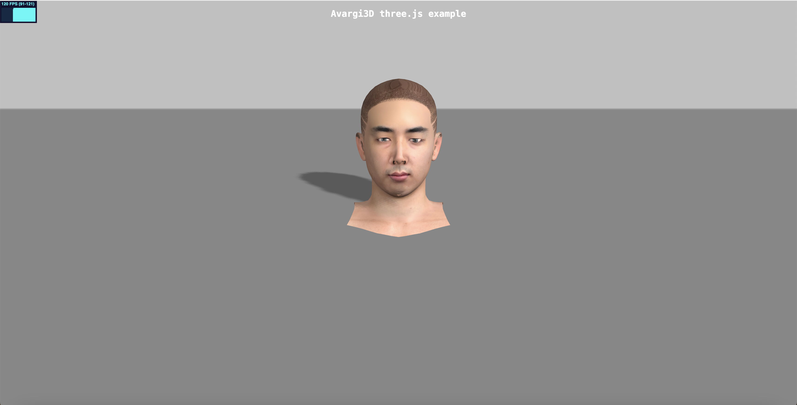

This example shows how to load [Avagi3D] avatars using three.js.



# Build

There is nothing to build, just run a http server in this folder. You can install one with e.g.: 

```bash
npm install -g local-web-server
```

And then run 

```bash
ws
```

The server will open up at `http://localhost:8000`

# Roadmap
- [x] Automatically generate the coarse 3D static model
- [x] Automatically generate the refined 3D static model
- [] Combine coarse and refined models pipline
- [] Automatically generate the blenshape
- [] Automatically audio-driven the blenshape
- [] Automatically visualize the generated Avagi3D

# Acknowledgments
we appreciate the following sources for creating this rep:

* [avaturn-threejs-example](https://github.com/avaturn/avaturn-threejs-example)
